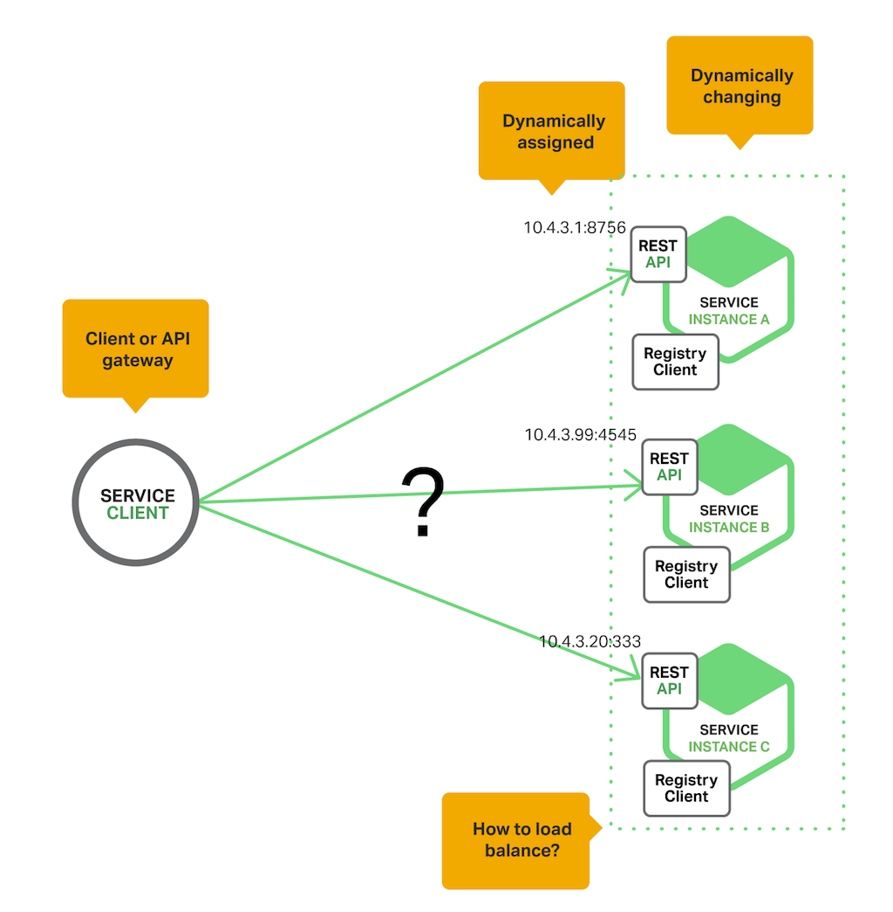

# 4. Descoberta de Serviço na Arquitetura de Microservices

## Por que usar a Descoberta de Serviço?
Vamos imaginar que estamos escrevendo um código que invoca um serviço que tem
uma API REST ou Thrift. Para efetuar a requisição, nosso código precisa saber
o local da rede (endereço IP e porta) de uma instância de serviço. Num 
aplicativo tradicional executado em hardware físico, os locais de rede das
instâncias de serviço são relativamente estáticos.

Entretanto, num aplicativo moderno de microservices baseado em nuvem, este é
um problema muito mais difícil de se resolver, como mostrado no diagrama a seguir.

    

Instâncias do serviço *Registry Client* são atribuídas com locais de rede
dinamicamente. Além disso, o conjunto de instâncias de serviço é alterado
dinamicamente por causa do dimensionamento automático, falhas e atualizações.
Por conseguinte, o código do cliente precisa usar algum mecanismo de 
**descoberta de serviço** mais elaborado.

Há **2 principais padrões de descoberta de serviço**:
- **Descoberta do lado Cliente**;
- **Descoberta do lado Servidor**.

### O padrão de descoberta do lado Cliente
Ao se utilizar a descoberta do lado Cliente, o mesmo é **responsável por
determinar os locais de rede de instâncias de serviço disponíveis e
solicitações de balanceamento de carga entre eles**.
- O Cliente consulta um **Serviço de Registro**, que é um banco de dados
de instâncias de serviço disponíveis. O Cliente então usa um algoritmo
de balanceamento de carga para selecionar uma das instâncias de serviço
disponíveis e faz uma solicitação.

O diagrama a seguir mostra a estrutura desse padrão.

    

**O local de rede de uma instância de serviço é registrado quando ele é iniciado**. 
Após o término da instância, o local de rede é removido do Serviço de Registro.

- **IMPORTANTE**: o registro da instância do serviço é normalmente
atualizado periodicamente usando um **mecanismo de heartbeat**.

- **Netflix OSS**: fornece um padrão de descoberta do lado cliente;

- **Netflix Eureka**: é um Serviço de Registro. Fornece uma API REST
para gerenciar o registro de instância de serviço e para consultar
instâncias;

- **Netflix Ribbon**: é um cliente IPC que funciona como o Eureka para
balancear as requisições entre instâncias de serviço disponíveis.

O padrão de descoberta do lado do Cliente tem uma variedade de benefícios e
desvantagens. Esse padrão é relativamente simples e, exceto para o serviço
de registro, não há "partes móveis". Além disso, como o cliente conhece
as instâncias de serviços disponíveis, ele pode tomar decisões de balanceamento
de carga inteligentes, específicas de aplicativos, como usar o hash de forma
consistente.

Um inconveniente significavo do padrão de descoberta do lado Cliente, é que ele
acopla o cliente com o Serviço de Registro, forçando-nos a implementar a
lógica de descoberta de serviço do lado Cliente para cada linguagem de
programação e estrutura usada pelos clientes do serviço.

### O padrão de descoberta do lado Servidor
A outra abordagem para a descoberta de serviço é o padrão de **descoberta
do lado servidor**. O diagrama a seguir ilustra a estrutura desse padrão.

    

O cliente faz uma solicitação para um serviço por meio de um **balanceador
de carga**. O balanceador de carga consulta o serviço de registro e encaminha
cada solicitação para uma instância de serviço disponível. Tal como ocorre
com a descoberta do lado cliente, as instâncias de serviço são registradas
e anuladas com o serviço de registros.

* **AWS Elastic Load Balancer** (ELB): é um exemplo de um roteador de 
descoberta do lado Servidor. Um ELB é comumente usado para balancear o
tráfego externo da Internet. No entanto, também podemos usá-lo para
balancear o tráfego interno numa **VPC** (Virtual Private Cloud). Um cliente
faz requisições (HTTP ou TCP) através do ELB usando seu nome DNS. A carga
ELB equilibra o tráfego entre um conjunto de instâncias do EC2 registradas
ou containers do EC2. Não há um Serviço de Registro separado. Em vez disso,
as instâncias EC2 e os containers ECS ([Amazon EC2 Container Service
](https://aws.amazon.com/pt/ecs/)) são registrados com o próprio ELB.

* Servidores HTTP e load balancers, como o NGINX Plus e NGINX também podem 
ser usados como um balanceador de carga de descoberta do lado servidor.

* Numa postagem deste [blog](https://www.airpair.com/scalable-architecture-with-docker-consul-and-nginx),
é descrito o uso do [Consul Template](https://github.com/hashicorp/consul-template)
para reconfigurar dinamicamente o NGINX como proxy-reverso;

* Alguns ambientes de implementação como [Kubernetes](https://kubernetes.io/) 
e [Marathon](https://mesosphere.github.io/marathon/docs/service-discovery-load-balancing.html)
executam um proxy em cada host no cluster. O proxy desempenha o papel de um
load balancer de descoberta do lado servidor. Para fazer uma solicitação a um 
serviço, um cliente encaminha a solicitação através do proxy usando o endereço 
IP do host e a porta atribuída do serviço. O proxy envia, então, de forma
transparente a solicitação para uma instância de serviço disponível em
execução em algum lugar no cluster.

* O padrão de descoberta do lado servidor tem vários benefícios e desvantagens.
Um grande benefício desse padrão é que os detalhes da descoberta são
abstraídos do cliente. Os clientes simplesmente fazem requisições ao load
balancer. Isso elimina a necessidade de implementar a lógica de descoberta
para cada linguagem de programação e estrutura usada pelos clientes
do serviço. Além disso, como mencionado, algns ambientes de implementação
fornecem essa funcionalidade gratuitamente. Este padrão também tem algumas
desvantagens, no entanto. A menos que o load balancer seja fornecido pelo
ambiente de implementação, é outro componente de sistema a ser configurado
e gerenciado.

## O Serviço de Registro
* É uma parte fundamental da descoberta de serviço;
* É um Banco de Dados que contém locais de rede de instâncias de serviço;
* Precisa estar altamente disponível e atualizado;
* Os clientes podem armazenar em cache locais de rede obtidos;
    - Devido a problemas de atualização das informações, um serviço
    de registro deve ser consistente, fazendo-se uso de um **cluster de
    servidores** que usam **protocolo de replicação** para **manter a 
    consistência**.

### Netflix Eureka
É um exemplo de Serviço de Registro. Fornece uma API REST para registrar
e consultar instâncias de serviço. 

* Uma instância de serviço se registra usado uma requisição **POST**;
* A cada 30s, deve manter seu registro atualizado com uma requisição **PUT**;
* Um registro é removido com a requisição **DELETE** ou pelo tempo
de registro da instância;
* O cliente pode recuperar as instâncias de serviço registradas usando
uma solicitação **HTTP GET**;

### Outros exemplos de Serviço de Registro
* [Etcd](https://github.com/coreos/etcd): BD consistente e distribuído
altamente disponível, que é usado para configuração compartilhada e para
descoberta de serviço. **Kubernetes** e **Cloud Foundry** já fazem
o uso do etcd;

* [Consul](https://www.consul.io/): ferramenta para descobrir e configurar
serviços. Fornece uma API que permite aos clientes registrar e descobrir
serviços. Pode ainda fazer *health check* para determinar a disponibilidade
do serviço;

* [Apache ZooKeeper](http://zookeeper.apache.org/): um serviço de coordenação
de alto desempenho amplamente utilizado para aplicações distribuídas.

* **IMPORTANTE**: muitos sistemas, como o **Kubernetes**, **Marathon** e
**AWS** não têm um serviço de registro explícito. Em vez disso, o mesmo
é apenas uma parte interna da infraestrutura.

## Opções do Serviço de Registro
Há um par de maneiras diferentes de lidar com o registro e cancelamento do
registro de um serviço. Uma opção é o padrão de **Auto-Registro** e a outra
é o padrão de **Registro de Terceiros**.

### O Padrão de Auto-Registro
A instância de serviço é responsável pelo registro e cancelamento do próprio
registro com o Serviço de Registro. Além disso, se necessário, uma instância
de serviço envia requisições de *heartbeat* para impedir que seu registro
expire. O diagrama a seguir mostra a estrutura desde padrão.

    

O padrão de Auto-Registro tem vários benefícios e desvantagens. Um benefício
é que é **relativamente simples** e não requer quaisquer outros componentes do
sistema. No entanto, uma **desvantagem importante é que ele acopla as 
instâncias de serviço ao Serviço de Registro**. **Vamos ter que implementar o
código de registro em cada linguagem de programação e estrutura usada por 
seus serviços**.

### O padrão de Registro de Terceiros
Ao se utilizar este padrão de Registro de Terceiros, as **instâncias de serviço
não são responsáveis por se registrarem com o Serviço de Registro**. Em vez
disso, outro componente do sistema conhecido como **Serviço Registrar**
controla o registro.

O **Serviço Registrar** rastreia as alterações feitas ao conjunto de instâncias
em execução, consultando o ambiente de implementação ou assinando eventos.
Quando ele percebe uma instância de serviço disponível, registra-o no 
Serviço de Registro. O Serviço Registrar também retira o registro das
instâncias de serviço encerradas. O diagrama abaixo mostrar a estrutura
desse padrão.

    

* [Registrator](http://gliderlabs.github.io/registrator/latest/): é um exemplo
de um Serviço Registrar. **Registra e retira automaticamente as instâncias
de serviço que são implementadas como containers do Docker**. Suporta
vários Serviços de Registro, incluindo o **Etcd** e **Consul**.

* O Serviço Registrar é um componente interno de ambientes de implementação.
As **instâncias da AWS EC2 criadas num grupo de escalonamento automático podem
ser registradas automaticamente com um ELB**. 

* Os serviços do **Kubernetes** são automaticamente registrados e disponibilizados 
para descoberta.

* **BENEFÍCIOS do Registro de Terceiros**: os serviços são dissociados do
Serviço de Registro. Não precisamos implementar a lógica de registro de
serviço para cada linguagem de programação e estrutura usada por seus
desenvolvedores. Em vez disso, o registro da instância de serviço é
tratado de forma centralizada dentro de um serviço dedicado.

* **DESVANTAGENS do Registro de Terceiros**: a menos que seja incorporado ao
ambiente de implementação, é outro componente de sistema altamente disponível
que precisamos configurar e gerenciar.
