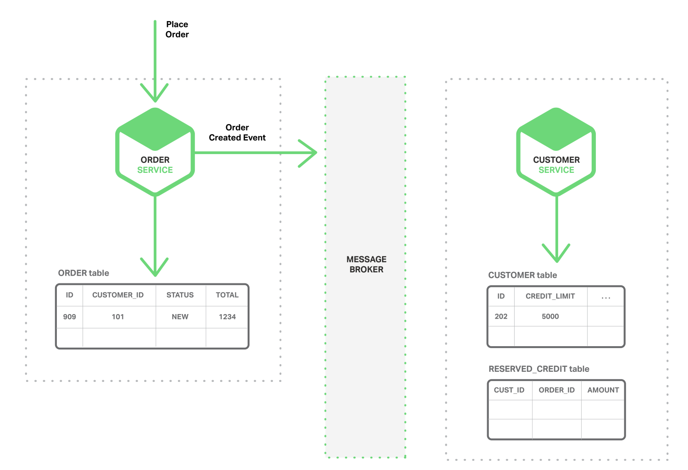
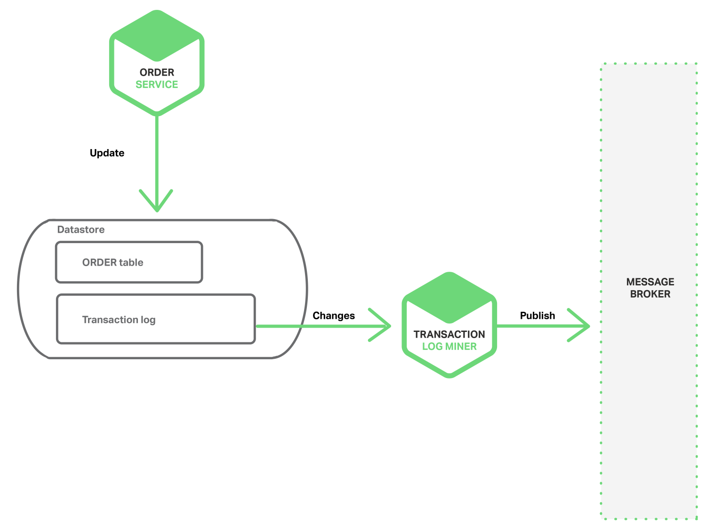

# 5. Gerenciamento de Dados Orientado a Eventos em Microservices

## Microservices e o Problema do Gerenciamento Distribuído dos Dados
Uma aplicação monolítica normalmente tem um único banco de dados relacional.
Um benefício de se utilizá-lo é que o aplicativo pode usar **transações ACID**.

Garantias fornecidas pelo **ACID**:
* **Atomicidade**: as alterações são feitas atomicamente;
* **Consistência**: o estado do Banco de Dados é sempre consistente;
* **Isolamento**: mesmo que as transações seja executadas simultaneamente,
parece que elas são executadas em série;
* **Durabilidade**: uma vez que uma transação tenha sido confirmada, ela
não é desfeita.

Como resultado, a aplicação pode simplesmente iniciar uma transação, alterar
várias linhas e confirmá-la.

Outra vantagem em se usar Banco de Dados relacional é pelo fornecimento
de uma linguagem de consulta rica, declarativa e padronizada - SQL. Boa
parte das consultas ocorrem de maneira transparente e otimizada, fazendo-nos
preocupar menos com detalhes em baixo nível.

* Entretanto, quando passamos para uma arquitetura de microserviços, o acesso
aos dados se torna mais complexo. A razão disso está no pertencimento dos dados
a cada microserviço de maneira privada, sendo acessados somente por meio da API
do serviço.
    - O encapsulamento dos dados assegura que os microserviços estão
    ligeiramente acoplados, podendo evoluir independentemente um do outro;
    - Se vários serviços acessarem os mesmos dados, as atualizações de
    *schema* irão requerer atualizações coordenadas e demoradas para todos
    os serviço.

* Para piorar a situação, cada microservice pode usar diferentes tipos de
Bancos de Dados (**abordagem de persistência poliglota**).
    - Por exemplo, um serviço que armazena e consulta texto poderá usar
    uma tecnologia de Banco de Dados como o **ElasticSearch**;
    - Outro exemplo é um serviço que armazena dados de gráficos
    de mídias sociais. Provavelmente será utilizada o **Neo4j**.

* Tendo-se uma arquitetura de Banco de Dados particionada, e ainda,
beneficiando-se da abordagem de persistência poliglota, será possível
ter serviços fracamente acoplados, com melhor desempenho e escalabilidade.
No entanto, isso acaba introduzindo novos desafios de gerenciamento
de dados distribuídos.

### Primeiro Desafio
O primeiro desafio é a implementação de transações comerciais que mantenham 
consistência entre vários serviços.

* Para auxiliar na percepção deste desafio, vamos dar uma olhada num exemplo
de uma loja on-line B2B (Business-to-Business):
    - O Serviço ao Cliente (Customer Service) mantém informações sobre 
    clientes, incluindo suas linhas de crédito;
    - O Serviço de Pedidos (Order Service) gera pedidos e deve verificar
    se um novo pedido não excede o limite de crédito do cliente;
    - Numa aplicação monolítica, uma simples transação ACID verificaria
    a disponibilidade de crédito para criar o pedido.

* Em contraste, na arquitetura de microserviços, as tabelas *ORDER* e 
*CUSTOMER* são privadas para seus respectivos serviços. O diagrama
abaixo ilustra isso.

    

* O Serviço de Pedidos não pode acessar diretamente a tabela de *CUSTOMER*.
Ele só pode usar a API fornecida pelo Serviço ao Cliente.
    - O Serviço de Pedidos até poderia utilizar a abordagem de **transações
    distribuídas** (conhecido como **Two-phase commit protocol**). Entretanto,
    devido às tecnologias diferentes de Bancos de Dados e compatibilidades, 
    pode não ser uma opção viável.

### Segundo Desafio
Consiste em implementar consultas que recuperam dados de vários serviços.
Por exemplo, vamos imaginar que a aplicação precisa exibir dados de cliente
e seus pedios recentes. Se o Serviço de Pedidos fornecer uma API para
recuperar pedidos de um cliente, então podemos recuperar esses dados usando
associação ao lado do aplicativo, isto é, o front-end se encarregaria de
associar os dados consultados em diferentes end-points.

O aplicativo recuperaria o cliente do Serviço ao Cliente e seus pedidos
do Serviço de Pedidos. Suponha, por outro lado, que o Serviço de Pedidos
só suporte a pesquisa de pedidos por sua chave primária (condição
num banco de dados NoSQL). Nessa situação, não há maneira óbvia para recuperar
os dados necessários.

## Arquitetura Orientada a Eventos
Para muitas aplicações, a solução é usar uma **arquitetura baseada em eventos**
(Event-Driven Architecture). Nesta arquitetura, um microservice publica um
evento quando algo notável acontece, como quando ele atualiza uma entidade
de negócios. Outros microservices podem contribuir com esses eventos.
Quando um microservice recebe um evento, ele pode atualizar suas próprias
entidades de negócios, o que pode levar a mais eventos a serem publicados.

* Podemos utilizar eventos para implementar transações comerciais que
abrangem vários serviços. Uma transação consiste numa série de etapas.
Cada etapa consiste numa atualização de entidade de negócios por um
microservice e na publicação do evento que aciona o próximo passo.

* A seguir, uma sequência de diagramas mostrar como podemos usar a
abordagem orientada a eventos para **verificar o crédito disponível
ao se criar um pedido**.
    - **Message Broker**: meio pelo qual os microservices trocam
    eventos.

* 1. O Serviço de Pedidos cria um Pedido com status **NEW** e publica
um **Evento de Criação de Pedido**.

    

* 2. O Serviço ao Cliente consome o **Evento de Criação de Pedido**,
reserva o crédito para o pedido e publica um **Evento de Reserva de
Crédito**.

    

* 3. O Serviço de Pedidos consome o **Evento de Reserva de Crédito** e altera
o estado do pedido para **OPEN**.

    

Um cenário mais complexo pode envolver etadas adicionais, como a reserva de
estoque ao mesmo tempo que o crédito do cliente é verificado.

* Desde que cada serviço atualize atomicamente o Banco de Dados e publique
um evento, além do **Message Broker** garantir que os eventos sejam entregues
pelos menos uma vez, então podemos implementar transações comerciais que
abranjam vários serviços.
    - **IMPORTANTE**: vale ressaltar que estas transações não são ACID. Eles
    oferecem garantias muito fracas, como a *consistência eventual*. Este
    modelo de transação foi referido como o modelo 
    [BASE](http://queue.acm.org/detail.cfm?id=1394128).

* Também podemos manter *views* materializadas que *pré-associam* dados
pertencentes a vários microservices. O serviço que mantém a *view* assina
os eventos relevantes e atualiza a *view*.
    - Exemplo: o Serviço de Atualização de Visualização de Pedidos de Cliente,
    que mantém uma exibição de Pedidos de Cliente, assina os eventos publicados
    pelo Serviço ao Cliente e pelo Serviço de Pedidos.

    

* Quando o Serviço de Atualização de Visualização de Pedidos de Cliente recebe
um evento de Cliente ou Pedido, ele atualiza a *view* de Pedidos de Cliente.
    - Podemos implementar a *view* de Pedidos de Cliente usando um Banco de 
    Dados de documentos, como o **MongoDB** e armazenar um documento para
    cada cliente. O Serviço de *view* de Consulta de Pedidos de Cliente
    processa pedidos de um cliente e de pedidos recentes consultando o
    os dados armazenados na *view* de Pedido de Cliente.

### Vantagens e Desvantagens da Arquitetura Baseada em Eventos
* **Vantagens**:
    - Permite a implementação de transações que abrangem vários serviços,
    fornecendo **consistência eventual**;
    - Permite que uma aplicação mantenha *views* materializadas.

* **Desvantagens**:
    - Modelo de programação é mais complexo do que ao se utilizar transações
    ACID;
    - Muitas vezes, devemos implementar transações de compensação para 
    recuperar de falhas no nível da aplicação. Exemplo: cancelamento de um
    pedido se a verificação de crédito falhar;
    - Aplicações devem lidar com dados inconsistentes. Isso ocorre porque
    as mudanças feitas por transações em execução são visíveis.
    - A aplicação também pode ver inconsistências se for lido de uma *view*
    materializada que ainda não está atualizada;
    - Assinantes dos eventos devem detectar e ignorar se os mesmos forem
    duplicados.

## Alcance da Atomicidade
Numa arquitetura orientada a eventos, há também o problema de atualização
atômica do Banco de Dados e a publicação de um evento. Por exemplo, o
Serviço de Pedidos deve inserir uma linha na tabela **ORDER** e publicar o
**Evento de Pedido Criado**. É essencial que estas duas operações sejam
feitas atomicamente. Se o serviço falhar após a atualização do Banco de Dados,
mas ocorrendo antes de publicar o evento, o sistema se tornará inconsistente.

* A maneira padrão para garantir atomicidade é usar uma transação distribuída
envolvendo o Banco de Dados e o Message Broker. Entretanto, pelas razões
descritas anteriormente, como o teorema CAP, isso é exatamente o que não
queremos fazer.

### Como publicar eventos usando transações locais
Uma maneira de atingir atomicidade é que a aplicação publique eventos usando
um **processo de etapas múltiplas envolvendo apenas transações locais**.
O truque é ter uma tabela **EVENT**, que funciona como uma fila de mensagens,
no Banco de Dados que armazena o estado das entidades de negócios.

A aplicação inicia uma transação de Banco de Dados (local), atualiza o estado
das entidades de negócios, insere um evento na tabela EVENT e confirma a
transação. Um thread ou processo de aplicação consulta a tabela EVENT,
publica os eventos no Message Broker e usa uma transação local para marcar os
eventos conforme publicados. O diagrama a seguir mostra o projeto.

    

* O Serviço de Pedidos insere uma linha na tabela ORDER e insere um **Evento
de Pedido Criado** na tabela EVENT. O thread ou processo do **Event Publisher**
consulta a tabela EVENT para eventos não publicados, publica os evento e, em
seguida, atualiza a tabela EVENT para marcar os eventos conforme publicados.

* **VANTAGENS**:
    - Garante um evento é publicado cada atualização sem depender de transações
    distribuídas;
    - A aplicação publica eventos a nível de negócios, o que elimina a 
    necessidade de inferir-los;

* **DESVANTAGENS**:
    - Potencialmente propensa a erros, pois o desenvolvedor deve se lembrar de
    publicar eventos;
    - Tem a limitação de ser mais desafiador para implementar em Bancos de Dados
    NoSQL, devido suas capacidades limitadas de transação e consulta.

### Minerando um log de transações de Banco de Dados
Outra forma de atingir a atomicidade sem transações distribuídas é que os
eventos sejam publicados por um thread ou processo que minere a transação de
Banco de Dados, o que resulta em alterações sendo registradas no log
de transações do Banco de Dados. O thread/processo de Transaction Log Miner
lê o log de transações e publica eventos para o Message Broker. O diagrama a 
seguir mostrar o projeto.

    

Exemplos de projetos que usam essa abordagem:

* [LinkedIn Databus](https://github.com/linkedin/databus): O Databus
extrai o log de transações Oracle e publica eventos correspondentes às
alterações. O LinkedIn usa o Databus para manter diversos data stores
derivados compatíveis com o sistema de registro;

* [Mecanimo de Streams no AWS DynamoDB](http://docs.aws.amazon.com/amazondynamodb/latest/developerguide/Streams.html):
é um Banco de Dados NoSQL gerenciado. Um *stream* DynamoDB contém a sequência
de alterações (criadas, atualizadas e excluídas) ordenadas pelo tempo feitas
nos itens de uma tabela DynamoDB nas últimas 24h. Um aplicação pode ler
essas alterações do *stream* e, por exemplo, publicá-las como eventos.

Vantagens e Desvantagens da mineração de log de transações:
* **VANTAGENS**:
    - Garantir que um evento é publicado para cada atualização sem
    usar transações distribuídas;
    - Pode simplificar a aplicação separando a publicação de eventos da lógica
    de negócios da mesma.

* **DESVANTAGENS**:
    - O formato do log de transações é proprietário de cada Banco de Dados e
    pode até mudar entre as versões do Banco de Dados;
    - A engenharia reversa dos eventos de negócio de alto nível das 
    atualizações de baixo nível registradas no log de transações pode ser mais 
    difícil.

### Usando o Sourcing de eventos
O fornecimento de eventos atinge atomicidade sem transações distribuídas usando
uma abordagem radicalmente diferente, centrada em eventos para entidades de
negócios persistentes. Em vez de armazenar o estado atual de um entidade, a
aplicação armazena uma sequência de eventos que mudam de estado. A aplicação
reconstrói o estado atual de uma entidade ao reproduzir os eventos. Sempre
que o estado de uma entidade de negócios é alterado, um novo evento é
anexado à lista de eventos. Como salvar um evento é uma única operação, ele
é inerentemente atômico.

* Para ver como funciona o *sourcing* de eventos, considere a entidade
Pedido como um exemplo. Num abordagem tradicional, cada pedido
mapeia para uma linha numa tabela ORDER e para linhas em, por exemplo, uma
tabela ORDER_LINE_ITEM. Porém, ao se utilizar o *sourcing* de eventos, 
o Serviço de Pedidos armazena um Pedido na forma de seus eventos de mudança
de estado: Criado, Aprovado, Enviado, Cancelado. Cada evento contém dados
suficientes para reconstruir o estado do Pedido.

    

Os eventos persistem numa **Store de Eventos**, que é um Banco de Dados de
eventos. O mesmo tem uma API para adicionar e recuperar eventos de uma
entidade. O Store de Eventos também se comporta como o Message Broker nas
arquiteturas descritas anteriormente. Ele fornece uma API que permite que
os serviços se inscrevam em eventos. O Store de Eventos entrega todos os
eventos a todos os assinantes interessados.

**IMPORTANTE**: O Store de Eventos é a espinha dorsal de uma arquitetura
de microserviços baseada em eventos.

Vantagens e Desvantagens do *sourcing* de eventos:

* **VANTAGENS**:
    - Resolve um dos principais problemas na implementação de uma arquitetura
    orientada a eventos e torna possível a publicação confiável de eventos
    sempre que o estado muda. Como resultado, resolve problemas de consistência
    de dados num arquitetura de microserviços;
    - A persistência de eventos em vez de objetos de domínio evita
    principalmente o problema de **incompatibilidade de impedância objeto-
    relacional**;
    - O fornecimento de eventos também oferece um registro de auditoria 100%
    confiável das alterações feitas a uma entidade de negócios e torna possível
    implementar consultas temporais que determinam o estado de uma entidade
    em qualquer ponto no tempo. Outro grande benefício do *sourcing* de eventos
    é que sua lógica de negócios consiste em entidades de negócios ligeiramente
    acopladas que trocam eventos.

* **DESVANTAGENS**:
    - Estilo diferente e desconhecido de programação e por isso há uma curva
    de aprendizado. O armazenamento de eventos apenas suporta diretamente a
    pesquisa de entidades de negócios por chave primária. Devemos usar o 
    **CQRS** (**Command Query Responsibility Segregation**) para implementar
    consultas. Como resultado, as aplicações devem manipular eventualmente
    dados consistentes.
