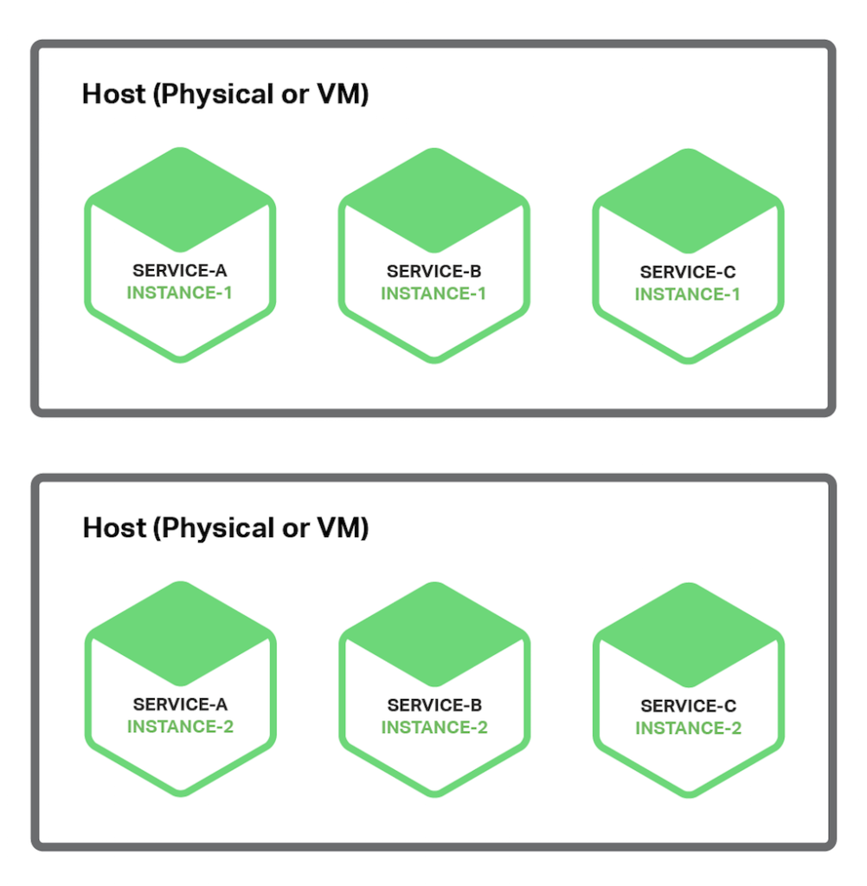
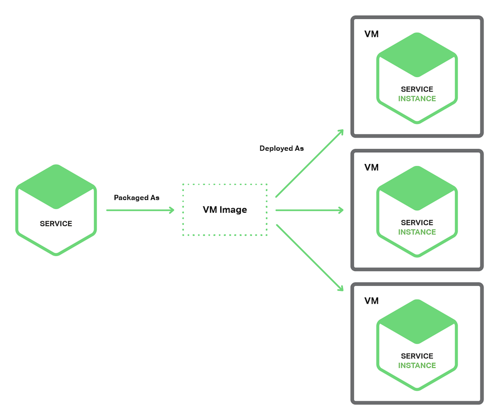
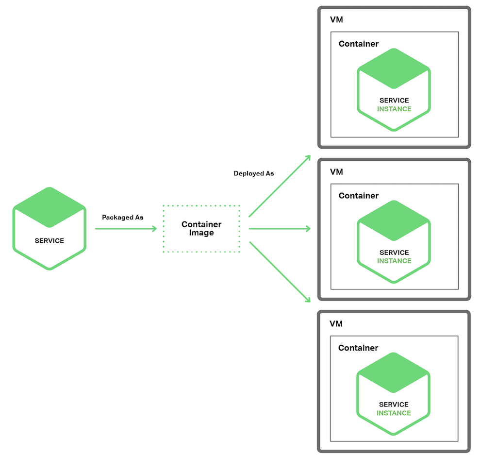

# 6. Escolhendo uma estratégia de implantação de Microservices

## Motivações
* A implantação (*deploy*) de uma aplicação monolítica significa executar
cópias múltiplas e idênticas de uma única aplicação, geralmente grande;
    - Normalmente, é fornecido *N* servidores (físicos ou virtuais), executando
    *M* instâncias da aplicação em cada um deles;
* A implantação de uma aplicação monolítica nem sempre é inteiramente direta,
mas é muito mais simples do que implementar uma aplicação de microserviços;

* Uma aplicação de microserviços consiste em dezenas ou centenas de serviços,
que podem estar escritos em uma variedade de linguagens e frameworks. Cada
um deles é uma "mini-aplicação" com seus próprios requisitos específicos
de deploy, recursos, dimensionamento e monitoramento. Por exemplo, podemos
precisar executar um certo número de instâncias de cada serviço com base
na demanda desse serviço.
    - Além disso, cada instância de serviço deve ser fornecida com a CPU
    apropriada, memória e recursos de E/S. O que é ainda mais desafiador é
    que, apesar desta complexidade, a implantação de serviços deve ser rápida,
    confiável e econômica.

A seguir, serão mostrados alguns padrões de deploy de microserviços.

## Múltiplas Instâncias de Serviço por Host Pattern
Uma maneira de implantar os microserviços é usar as instâncias de múltiplos
serviços por host pattern. Ao se usar esse padrão, fornecemos um ou mais
hosts físicos ou virtuais para neles serem executados várias instâncias
de serviço em cada um. É uma abordagem bastante tradicional. Cada
instância de serviço é executada numa porta bem-conhecida em um ou mais
hosts. As máquinas hosts são comumente tratados como "animais de estimação".

O diagrama a seguir mostra a estrutura desse padrão.

    

Há um par de variantes deste padrão. Umas delas é que cada instância
de serviço ser um processo ou grupo de processos. 
    - Por exemplo, podemos implantar uma instância de serviço Java
    como uma aplicação Web num servidor Apache Tomcat. Uma instância de
    serviço Node.js pode consistir num processo pai e um ou mais
    processos filho.
    
Outra variante deste padrão é executar várias instâncias de serviço no mesmo
processo ou grupo de processos.
    - Por exemplo, podemos implantar várias aplicações Web em Java no mesmo
    servidor Apache Tomcat ou executar vários bundles OSGI no mesmo container
    OSGI.
    
Vantagens e Desvantagens do padrão de Múltiplas Instâncias de Serviço por Host
Pattern:

* **Vantagens**:
    - Uso de recursos é relativamente eficiente. Múltiplas instâncias de
    serviço compartilham o servidor e seu sistema operacional. É mais
    eficiente ainda se um processo ou grupo de processos executa várias
    instâncias de serviço, por exemplo, várias aplicações Web que partilham
    o mesmo servidor Apache Tomcat e a JVM;

    - Implantação de uma instância de serviço é relativamente rápida. Basta
    copiar o serviço para um host e iniciá-lo;
    
    - Por causa da falta de sobrecarga, iniciar um serviço é geralmente muito
    rápido. Se o serviço for seu próprio processo, basta iniciá-lo. Caso
    contrário, se o serviço é uma das várias instâncias em execução no mesmo
    processo de um container ou grupo de processos, podemos implantá-lo
    dinamicamente no container ou reiniciar o container.
    
* **Desvantagens**:
    - Há pouco ou nenhum isolamento das instâncias de serviço, a menos que cada
    instância de serviço seja um processo separado. Embora possamos monitorar
    com precisão a utilização de recursos de cada instância de serviço, não é
    possível limitar os recursos que cada instância usa. É possível que uma
    instância de serviço "malcriada" consuma toda a memória ou CPU do host.

    - Não existe nenhum isolamento se várias instâncias de serviço são
    executadas no mesmo processo. Todas as instâncias podem, por exemplo,
    compartilhar a mesma memória heap da JVM. Uma instância de serviço 
    "malcriada" poderia facilmente quebrar os outros serviços em execução no
    mesmo processo. Além disso, não temos nenhuma maneira de monitorar os
    recursos usados por cada instância de serviço.
    
    - Outro problema significativo com esta abordagem é que a equipe de 
    operações que implanta um serviço tem que conhecer os detalhes específicos
    de como fazê-lo. Os serviços podem ser escritos em uma variedade de 
    linguagens e estruturas, portanto, há muitos detalhes que a equipe de
    desenvolvimento deve compartilhar com as operações. Essa complexidade
    aumenta o risco de erros durante a implantação.
    
## Instância de Serviço por Host Pattern
É outra forma de implantar os microserviços. Quando usamos esse padrão,
executamos cada instância de serviço isoladamente em seu próprio host.
Existem duas diferentes especializações deste padrão:
- Instância de Serviço por **Máquina Virtual (VM)**;
- Instância de Serviço por **Container**.
    
### Instância de Serviço por VM Pattern
Quando usamos esse padrão, podemos empacotar cada serviço como uma imagem
de uma Máquina Virtual (VM) como um [Amazon AMI EC2](https://aws.amazon.com/pt/ec2/).
Cada instância de serviço é uma VM (por exemplo, uma instância EC2) que é 
iniciada usando essa imagem de VM. O diagrama a seguir mostrar a estrutura
desse padrão:

    

* Essa é a principal abordagem usada pela Netflix para implantar seu
serviço de streaming de vídeo. A Netflix empacota cada um dos seus serviços
como um EC2 AMI usando o [Aminator](https://github.com/Netflix/aminator).
Cada instância de serviço em execução é uma instância do EC2.

* Há uma variedade de ferramentas que podemos usar para construir nossas
próprias VMs:
    - **Servidor de Integração Contínua (CI)**: podemos configurar o
    **Jenkins**, por exemplo, para invocar o Aminator para empacotar os
    serviços como um EC2 AMI.
    - [Packer.io](https://www.packer.io/): é outra opção para a criação
    automática de imagens VM. Ao contrário do Aminator, ele suporta
    uma variedade de tecnologias de virtualização, incluindo EC2,
    DigitalOcean, VirtualBox e VMWare.

A empresa [Boxfuse](https://boxfuse.com/) tem uma maneira convincente de
construir imagens de VM, que supera as desvantagens das VMs descritas
a seguir. O Boxfuse empacota nossa aplicação Java como uma imagem
VM mínima. Estas imagens são rápidas para construir, iniciar rapidamente
e são mais seguras, pois expõem uma interface limitada para ataques.

O modelo de instância de serviço por VM tem uma série de vantagens e 
desvantagens:

* **Vantagens**: 
    - Um grande benefício das VMs é que cada instância de serviço
    é executada em completo isolamento. Ele tem uma quantidade fixa de uso de CPU
    e memória e não pode "roubar" recursos de outros serviços;
    
    - Encapsula a tecnologia de implementação do serviço em questão. Uma vez
    que um serviço foi empacotado como uma VM, torna-se, portanto, uma caixa 
    preta. A API de gerenciamento da VM é a API de implantação do serviço.
    A implantação se torna muito mais simples e mais confiável.

* **Desvantagens**:
    - Utilização de recursos menos eficiente. Cada instância de serviço tem a
    sobrecarga de uma VM inteira, incluindo o sistema operacional. Além disso,
    em um **IaaS** (Infraestrutura como Serviço), as VMs vêm em tamanhos fixos
    e é possível que a VM seja subutilizada.

    - Um IaaS normalmente cobra pelas VMs, independentemente de estar ocupado
    ou ocioso. Um IaaS, como a AWS, fornece autoscaling, mas é [difícil
    reagir rapidamente às mudanças na demanda pelos serviços](http://techblog.netflix.com/2013/11/scryer-netflixs-predictive-auto-scaling.html). 
    Consequentemente, teremos que muitas vezes sobreprovisionar (elevar as
    medidas) as VMs, o que aumenta o custo de implantação.
    
    - Implantação de uma nova versão, em geral, é lenta. Imagens de VM são
    normalmente lentas para construir devido ao seu tamanho. Além disso,
    VMs são por vezes lentas para instanciar, novamente, por causa de
    seu tamanho. Além disso, um SO leva alguem tempo para iniciar. Note,
    no entanto, que isso não é universalmente verdadeiro, uma vez que
    VMs leves, como as fornecidas pelo Buxfuse, existem.
    
    - Em geral, temos que ser responsáveis por um monte de levantamento
    pesado de VMs. A menos que consigamos usar uma ferramenta como o Boxfuse,
    que manipula a sobrecarga de construção e gerenciamento das VMs, então
    é de nossa responsabilidade a administração das VMs. Esta atividade 
    necessária e demorada acaba nos desviando do core da aplicação, isto é, 
    do que na real é preciso fazer.
    
### Instância de Serviço por Container Pattern
* Cada instância de serviço é executada em seu próprio container.
* **CONTAINER**: é um mecanismo de [virtualização a nível do sistema 
operacional](https://en.wikipedia.org/wiki/Operating-system-level_virtualization).
Um container consiste de um ou mais processos em execução num sandbox. Do
ponto de vista dos processos, eles têm seu próprio namespace de porta e
sistema de arquivos. Podemos limitar a memória de um container e recursos
de CPU. Algumas implementações de container também têm limite de taxa de
E/S.
    - Exemplos de tecnologias: [Docker](https://www.docker.com/) e 
    [Solaris Containers](https://en.wikipedia.org/wiki/Solaris_Containers)

O diagrama a seguirmostrar a estrutura desse padrão:

    

* Para usar esse padrão, precisamos compactar o serviço como uma imagem de
container. Uma imagem de container é uma imagem de sistema de arquivos
composta pelas aplicações e bibliotecas necessárias para executar o serviço.
Algumas imagens de container consistem em um sistema de arquivos Linux
completo. Outras são mais leves.
    - Para implantar um serviço Java, por exemplo, temos que criar uma
    imagem de container contendo o binário em Java, talvez um servidor
    Apache Tomcat e a aplicação Java compilada.

* Depois de termos empacotado o serviço como uma imagem de container, 
então iniciaremos um ou mais containers. Normalmente, pode-se executar
vários containers em cada host físico ou virtual.
    - Podemos usar um **Gerenciador de Cluster**, como o **Kubernetes** ou
    **Marathon** para gerenciar os containers;
    - Um gerenciador de cluster trata os hosts como um conjunto de recursos.
    Ele decide onde colocar cada container com base nos recursos exigidos
    pelo mesmo e recursos disponíveis em cada host.

O padrão de instância por Container Pattern tem vantagens e desvantagen:

* **Vantagens**:
    - Benefícios semelhantes aos das VMs;
    - Isolam as instâncias de serviço umas das outras;
    - Pode-se monitorar facilmente os recursos consumidos por cada container;
    - Encapsulam a tecnologia usada para implementar os serviços;
    - A API de gerenciamento de container também serve como API para gerenciar
    os serviços;
    - Ao contrário das VMs, os containers são mais leves. As imagens
    normalmente são muito rápidas de se construir.

* **Desvantagens**:
    - A infraestrutura de container não é tão amadurecida quando das VMs;
    - A segurança deve ser redobrada, uma vez que os containers compartilham
    o kernel do sistema operacional do host;
    - Temos que ser responsáveis pelo levantamento pesado da administração
    das imagens do container. Além disso, a menos que estejamos usando uma
    solução de container hospedada, como a 
    [Google Container Engine](https://cloud.google.com/container-engine/)
    ou [Amazon EC2 Container Service](https://aws.amazon.com/pt/ecs/),
    temos que administrar a infraestrutura de container e possivelmente a
    infraestrutura de VM em que ela é executada.
    - Além disso, os containers são frequentemente implementados em uma
    infraestrutura que tem preços por VM. Consequentemente, como descrito
    anteriormente, será provável que teremos que incorrer no custo extra
    de "overprovisioning" (superdimensionamento das configurações 
    de hardware) das VMs, a fim de lidar com picos de carga.

* É curioso notar que a distinção entre containers e VMs é um pouco nebulosa.
Como dito anteriormente, VMs da Boxfuse são rápidas de se construir e iniciar.
    - Projeto [Intel Clear Containers](https://clearlinux.org/features/clear-containers):
    projeto da Intel visando à criação de VMs leves;
    - [Unikernels](https://en.wikipedia.org/wiki/Unikernel): tecnologia de 
    sistemas baseados em espaço de endereçamento único construído usando
    bibliotecas de sistemas operacionais.

## Implantação Serverless (sem servidor)
É um conceito de implantação mais novo e que cada vez tem se 
tornado popular. Naturalmente, dispensa a questão de ter que se escolher
o local de implementação dos serviços, geralmento feito em containers ou VMs.

### AWS Lambda
A [AWS Lambda](https://aws.amazon.com/pt/lambda/) é um exemplo
de tecnologia Serverless (sem servidor). Suporta Java, Node.js, Python, 
PHP, Ruby e etc. Para implantar um microserviço, teremos que empacotá-lo
e o enviar para a AWS Lambda.
    - Também podemos fornecer metadados, que entre outras coisas, especifica
    o nome da função que é invocada para lidar com uma requisição (também
    conhecida como evento);
    - O AWS Lambda executa automaticamente instâncias suficientes do
    nosso microserviço para processar requisições. Somos cobrados por
    cada requisição com base no tempo gasto e na memória consumida;
    - A noção de dispensar aspectos em relação à implantação é
    muito atraente.

* Fornece o conceito de **Função Lambda**, que é um serviço *stateless* (sem 
estado). Geralmente, trata requisições invocando serviços da AWS.
    - Exemplo: função Lambda é invocada quando uma imagem é carregada para um
    bucket S3 da AWS, podendo inserir um item em uma tabela de imagens
    do DynamoDB, além de publicar uma mensagem em um Kinesis stream para
    para acionar o processamento de imagem. Uma função Lambda pode também
    invocar serviços da Web de terceiros.

* Há 4 maneiras de invocar uma Função Lambda:

1. Diretamente, usando uma requisição da Web;
2. Automaticamente, em resposta a um evento gerado por um serviço da AWS
(como S3, DynamoDB, Kinesis ou algum serviço de email);
3. Automaticamente, através de um AWS API Gateway para lidar com requisições
HTTP de clientes da aplicação.
4. Periodicamente, de acordo com uma tarefa **cron** (tarefa agendada).

* A AWS Lambda é uma maneira conveniente de implantar microservices. O
custo baseado em requisição significa que só pagaremos pelo trabalho
realizado pelos serviços. Além disso, não somos responsáveis pela
infraestrutura de TI, o que nos permite concentrarmos no desenvolvimento
da nossa aplicação.

* Existem algumas limitações significativas. Não se destina a ser usado para
implantar serviços de longa duração de execução. As requisições devem ser
concluídas em até 300 segundos. Os serviços devem ser stateless, uma vez que,
em teoria, a AWS Lambda pode executar uma instância separada para cada
solicitação. Eles devem ser escritos em linguagens suportadas. Os
serviços também devem começar rapidamente; caso contrário, eles podem ser
expirados e encerrados.

### StdLib
O [Stdlib](https://stdlib.com/) é uma alternativa ao AWS Lambda.
